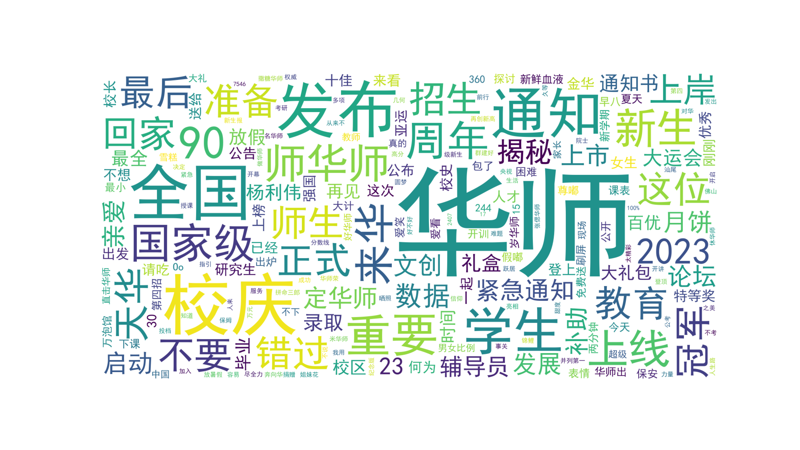

# 基于晚安华师文章爬取
自用需求：爬取文章的**内容，标题，标签，日期**

（2024.5.1更新，release 2023-2024的[微信文章数据](data23-24/content_pp_2024.csv)，仅供学习交流）

## fiddler 抓包
- [x] 通过微信公众号平台获取文章url（其实这个url应该是文章发布前创建的图文素材）
- [x] 通过微信PC客户端获取cookie (appmsg_token是包含在用户cookie里面的)

## 版本v2

- [x] 根据url实现爬取微信文章，优化2024年的微信文章爬取代码
- [x] 爬取《晚安华师》2023.5.18日 - 2024.4.23日的所有微信文章，目前收集量180篇，平均2天一篇kpi拉满了啊
- [x] 鉴于今年发现晚华的标题总是“**click-bait**”（标题党），增加今年文章的标题和内容预处理、分析代码，并去掉停用词制作词云图，展示如下：

2023-24 晚华文章标题的词云

2023-24 晚华文章内容的词云

## ~~版本v1~~

- [x] ~~爬取《晚安华师》2014年开始 - 2023.5.18日前的所有微信文章，目前收集量2224篇，未来会release~~
- [x] ~~实现基于langchain-chatglm-6b-int4的知识库构建，在一张2080Ti上部署QA机器人（2024.4测试还可用）~~

## 一些坑
1. 之前公众号平台的“图文素材”现在变成了“创作-图文消息”
2. 公众号平台连续点击30页左右会显示“系统出错，请稍后重试”，等一段时间就会好了，可长可短
3. 用get_article_url.py获取的文章url是长期的
4. 用get_url_content.py获取文章内容会出现连续的"('', 0 ,0 )" ，这种跟1的情况差不多，就是检测你调用过多的保护机制，等段时间重试即可
5. 根据3的情况做多次调用，最后还是能获取到文章内容的，自己实现complete_content的功能
6. 由于公众号平台编辑图文（修改推送内容）会导致部分爬取的文章内容为空或者重复，属于脏数据，可自行处理，注意区分
7. 晚华推送起名喜欢用emoji，直接使用print可能会导致出错，建议编码全部采用unicode(utf-8)
8. 早期的文章评论解析不了，估计是文章的json格式被修改过
9. 2024版本发现微信的人变聪明了？把json的那一页猛加反斜杠，导致之前的解析代码不行了。

## 有待完善
- [x] 发布爬取并处理过的晚华文章，发布数据集仅供学术研究，需要文章数据集的朋友可以发邮件联系我
- [x] 爬取补充文章的评论
- [x] 持续爬取最新的文章，所有的数据版本需要合并
- [x] 点赞、转发
- [ ] ~~爬取文章图片（有link，暂时不是需求）~~

更详细可参考[原仓库说明](https://github.com/wnma3mz/wechat_articles_spider)
